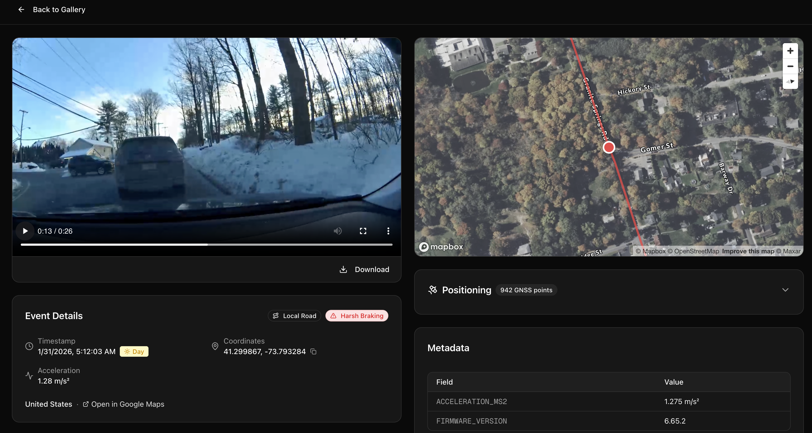

# Using the AI Event Videos API from Bee Maps

This is a web application for browsing, filtering, and analyzing AI-detected driving events videos captured by Hivemapper dashcams.
View event videos, run AI scene analysis, detect and track road actors, inspect speed profiles, explore GNSS/IMU sensor data, and see nearby map features — all on an interactive map.


## Features

**Homepage**


**Event Video Detail View**



**Full Feature List**

- **Event Gallery** — Browse events in a grid view with video thumbnails, or switch to an interactive map view
- **AI Filter Agent** — Natural language search powered by Claude. Ask questions like "Harsh braking in London last week" and the agent translates your query into structured filters to find matching events
- **Highlights** — Curated collections of notable events with trending discovery and search for new extreme events
- **Filtering** — Filter by date range, event type, time of day (day/dawn/dusk/night), country, and geographic coordinates with radius
- **Event Detail View** — Play event videos with speed overlay, synchronized map playback showing the GNSS track, and downloadable video
- **AI Video Scene Analysis** — Claude-powered analysis of full event videos including road conditions, signage, objects, visibility, driving behavior assessment, and hazard evaluation. Supports batch analysis of multiple events and follow-up questions
- **Actor Detection & Tracking** — Detect vehicles, pedestrians, cyclists, and animals in video frames using Claude vision. Track actors across multiple frames to build trajectories visualized on the map
- **Speed Profile** — Interactive speed chart with click-to-seek, speed limit overlays, and configurable mph/km/h units
- **Positioning Data** — Inspect raw GNSS (lat/lon/altitude) and IMU (accelerometer/gyroscope) sensor data in collapsible tables
- **Nearby Map Features** — See stop signs, speed signs, and other map features near an event location
- **Frame Labeling** — Extract individual video frames at any timestamp and pair them with nearby map feature labels for training data export
- **Road Classification** — Automatic road type identification (highway, primary, residential, etc.)
- **Geo-Projection** — Convert 2D bounding boxes to world GPS coordinates using camera intrinsic parameters
- **Settings** — Configure API keys, speed display units (mph/km/h), and camera intrinsic parameters from a dedicated settings page

## Event Types

| Type | Description |
|------|-------------|
| Harsh Braking | Sudden deceleration detected |
| Aggressive Acceleration | Rapid acceleration detected |
| Swerving | Lateral movement deviation |
| High Speed | Speed exceeding threshold |
| High G-Force | Elevated g-force detected |
| Stop Sign Violation | Failure to stop at stop sign |
| Traffic Light Violation | Running a red light |
| Tailgating | Following too closely |

## AI Filter Agent

The Agent tab opens a chat interface where you can describe what you're looking for in plain English. The agent uses Claude (Sonnet 4.5) to parse your query into structured filters — event types, date ranges, time of day, and geographic coordinates — then fetches matching events from the Bee Maps API.

Example queries:
- "Harsh braking in London last week"
- "Stop sign violations in the past 3 days"
- "High speed events at night near 37.7749, -122.4194"

Requires an [Anthropic API key](https://console.anthropic.com), which can be configured in the settings dialog.

## AI Video Scene Analysis

The event detail page includes an AI-powered scene analysis feature that sends the full event video to Claude for comprehensive understanding:

- **Road Analysis** — Lane count, road type, surface, markings, curvature, grade, intersections
- **Signage Detection** — Traffic lights, stop signs, speed limits, yield signs, warnings, construction signs
- **Object Detection** — Vehicles, pedestrians, cyclists, animals with relevance filtering
- **Visibility Assessment** — Glare, weather, lighting conditions
- **Driving Assessment** — Evaluates driving behavior as normal, cautious, aggressive, erratic, or emergency
- **Hazard Evaluation** — Severity rating (none/low/moderate/high/critical) with contributing factors
- **Frame-by-Frame Notes** — Timeline of key observations throughout the video
- **Interactive Chat** — Ask follow-up questions about the analyzed scene

From the gallery, the **Analyze All** button enables batch analysis of all currently filtered events with progress tracking.

## Actor Detection & Tracking

Detect and track road actors (vehicles, pedestrians, cyclists, animals) in event videos using Claude vision:

- **Single-Frame Detection** — Identify all actors in a video frame with bounding boxes, distance estimates, and movement indicators
- **Multi-Frame Tracking** — Track actors across multiple frames to build trajectories over the duration of the event
- **Map Visualization** — Detected actors and tracks are projected onto the map using camera intrinsic parameters and geo-projection
- **Caching** — Detection results are cached in localStorage to avoid redundant API calls

Requires an [Anthropic API key](https://console.anthropic.com) and camera intrinsic parameters (configurable in Settings).

## Highlights

The Highlights page showcases curated collections of notable driving events:

- **Extreme Braking** — Events with the largest speed drops (60+ km/h deceleration)
- **Highest G-Force** — Events with the most intense acceleration moments
- **Highest Speed** — Fastest recorded events
- **Fastest Acceleration** — Events with the greatest acceleration rates
- **Most Extreme Swerving** — Events with the sharpest lateral deviation
- **International Highlights** — Notable events from cities around the world (London, Berlin, Tokyo, Sydney, Toronto, Sao Paulo)
- **Trending** — Automatically discover interesting events from the past month
- **Discover New** — Search for additional extreme events beyond the curated collection

## External APIs

This application uses the following external APIs:

### Bee Maps API

API Specs: [Bee Maps AI Event Videos](https://beemaps.com/api/developer/docs#tag/aievents/POST/aievents/search)

| Endpoint | Method | Description |
|----------|--------|-------------|
| [/aievents/search](https://beemaps.com/api/developer/docs#tag/aievents/POST/aievents/search) | POST | Search for AI events by date range, event type, and geographic polygon |
| [/aievents/{id}](https://beemaps.com/api/developer/docs#tag/ai-events/GET/aievents/{id}) | GET | Get a single event by ID, optionally including GNSS and IMU data |
| [/map-data](https://beemaps.com/api/developer/docs#POST/mapFeatures/poly) | POST | Query map features (stop signs, speed signs, etc.) within a geographic polygon |
| [/devices](https://beemaps.com/api/developer/docs#GET/devices) | GET | Get camera intrinsic parameters (focal length, distortion coefficients) for Hivemapper Bee devices |

Authentication: BeeMaps API key.  Get API Key https://beemaps.com/developers

### Mapbox APIs

| API | Description |
|-----|-------------|
| [Map GL JS](https://docs.mapbox.com/mapbox-gl-js/) | Interactive map rendering for event locations and GNSS tracks |
| [Tilequery API](https://docs.mapbox.com/api/maps/tilequery/) | Reverse lookup of road classification at a given coordinate |
| [Geocoding API](https://docs.mapbox.com/api/search/geocoding/) | Reverse geocoding to resolve country names from coordinates |

Authentication: Mapbox access token.

### Anthropic API

| API | Description |
|-----|-------------|
| [Messages API](https://docs.anthropic.com/en/api/messages) | Powers the AI Filter Agent, video scene analysis, and actor detection — Claude Sonnet 4.5 interprets natural language queries, analyzes video content, and detects road actors |

Authentication: Anthropic API key. Get one at [console.anthropic.com](https://console.anthropic.com).

### FFmpeg (local)

Used server-side to extract video frames and generate thumbnails. Must be installed on the host machine.

## Getting Started

### Prerequisites

- Node.js 18+
- FFmpeg installed and available on `PATH`
- A [Bee Maps API key](https://beemaps.com/developers)
- A [Mapbox access token](https://account.mapbox.com)
- An [Anthropic API key](https://console.anthropic.com) (optional, for AI Filter Agent, scene analysis, and actor detection)

### Setup

1. Clone the repository:

```bash
git clone https://github.com/Hivemapper/ai-event-videos.git
cd ai-event-videos
```

2. Install dependencies:

```bash
npm install
```

3. Configure environment variables:

```bash
cp .env.example .env.local
```

Edit `.env.local` and add your Mapbox token:

```
NEXT_PUBLIC_MAPBOX_TOKEN=your_mapbox_token_here
```

The Bee Maps API key and Anthropic API key can be set via the `.env.local` file or configured through the settings dialog in the UI.

4. Start the development server:

```bash
npm run dev
```

Open [http://localhost:3000](http://localhost:3000) to view the app.

## Project Structure

```
src/
├── app/
│   ├── api/
│   │   ├── agent/           # AI Filter Agent endpoint (Claude-powered query parsing)
│   │   ├── analyze/         # AI video scene analysis endpoint
│   │   ├── detect-actors/   # Actor detection endpoint (Claude vision)
│   │   ├── events/          # Proxy for Bee Maps AI events API
│   │   ├── frames/          # FFmpeg frame extraction at specific timestamps
│   │   ├── highlights/      # Trending and discovery endpoints for highlights
│   │   ├── labeled-frame/   # Frame extraction + nearby map feature labels
│   │   ├── map-features/    # Proxy for Bee Maps map data API
│   │   ├── road-type/       # Mapbox road classification lookup
│   │   ├── thumbnail/       # FFmpeg thumbnail generation
│   │   └── video/           # Video proxy for CORS-free playback
│   ├── event/[id]/          # Event detail page
│   ├── highlights/          # Curated highlights page
│   ├── settings/            # Settings page (API keys, units, camera intrinsics)
│   └── page.tsx             # Home page (event gallery + agent view)
├── components/
│   ├── events/              # Event grid, cards, filters, video player, analysis, actor controls
│   ├── layout/              # Header with tab navigation
│   ├── map/                 # Mapbox map components with actor visualization
│   └── ui/                  # Reusable UI components (shadcn/ui)
├── hooks/                   # React hooks for data fetching, actor detection, event polling
├── lib/                     # Utilities, constants, geo-projection, agent skills, highlights
└── types/                   # TypeScript type definitions (events, actors)
```

## Tech Stack

- **Data API**: [Bee Maps](https://docs.beemaps.com/platform/road-intelligence-api)
- **AI**: [Anthropic Claude](https://docs.anthropic.com) (Sonnet 4.5 for natural language filter agent, video scene analysis, and actor detection)
- **Framework**: [Next.js](https://nextjs.org) 16 (App Router)
- **Language**: TypeScript
- **Styling**: [Tailwind CSS](https://tailwindcss.com) 4
- **UI Components**: [shadcn/ui](https://ui.shadcn.com) + [Radix UI](https://www.radix-ui.com)
- **Maps**: [Mapbox GL JS](https://docs.mapbox.com/mapbox-gl-js/)
- **Icons**: [Lucide React](https://lucide.dev)

## Blog Post
Read the [blog post](https://beemaps.com/blog/ai-event-videos-real-world-driving-incidents-as-training-data) about this app.
